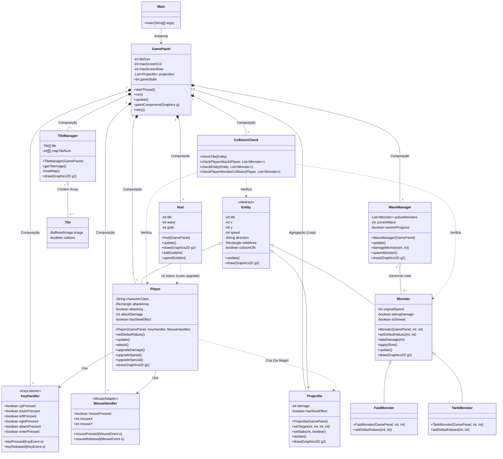

# BitGuardians 🛡️⚔️


**BitGuardians** é um jogo 2D com elementos de Tower Defense, desenvolvido em Java. Este projeto foi criado como parte da disciplina de Linguagem de Programação Orientada a Objetos da Universidade de Pernambuco.

O objetivo do jogo é proteger a base no lado esquerdo da tela, impedindo que hordas de monstros que avançam em ondas consigam atravessar.

## ✨ Funcionalidades

* **Sistema de Ondas de Inimigos:** Os monstros surgem em ondas progressivamente mais difíceis (`WaveManager`).
* **Seleção de Personagens:** O jogador pode escolher entre duas classes distintas antes de iniciar o jogo (`GamePanel`).
* **Mecânicas de Combate:** Cada classe possui um tipo de ataque único para derrotar os inimigos.
* **Colisão Física:** Implementação de um sistema de colisão com os limites do mapa (`CollisionCheck`) e um efeito de *knockback* ao tocar nos monstros (`Player`).
* **Interface Gráfica Simples:** Menus e HUD construídos com Java Swing.

## ⚔️ Classes Jogáveis

O jogo apresenta duas classes com estilos de combate diferentes:

1.  **Espadachim:** Um guerreiro focado no combate corpo a corpo. Seu ataque é um golpe de espada que atinge inimigos em uma área próxima.
2.  **Mago:** Um mestre das artes arcanas que ataca à distância. Ele dispara projéteis mágicos que viajam pela tela para atingir os inimigos.

## 🚀 Como Executar

Para compilar e rodar o projeto, você precisará ter o **JDK 17 ou superior** instalado.

### Via executável (recomendado)
1. Baixe o arquivo .jar presente na aba de releases: [Clique aqui](https://github.com/AdryanCALS/BitGuardians/releases).
2. Rode o arquivo com o JDK 17 ou superior instalado localmente.

### Via IDE

1.  Clone ou baixe este repositório.
2.  Abra o projeto na sua IDE Java preferida (IntelliJ, Eclipse, etc.).
3.  Localize o arquivo `src/main/Main.java`.
4.  Execute o método `main` para iniciar o jogo.

### Via Linha de Comando

1.  Navegue até a pasta raiz do projeto.
2.  Compile todos os arquivos `.java`:
    ```bash
    javac -d out src/main/*.java src/entity/*.java src/tile/*.java
    ```
3.  Execute o jogo:
    ```bash
    java -cp out main.Main
    ```

## 🎮 Controles

| Ação              | Tecla          |
| ----------------- | -------------- |
| Mover para Cima   | `W`            |
| Mover para Baixo  | `S`            |
| Mover para Esquerda| `A`            |
| Mover para Direita| `D`            |
| Atacar            | `Barra de Espaço` |
| Confirmar (Menus) | `Enter`        |
| Upgrade Dano      | `1`|
| Upgrade Speed|`2`|
| Upgrade Especial|`3`|


## 📂 Estrutura do Projeto

O código-fonte está organizado nos seguintes pacotes:

* `main`: Contém as classes principais que gerenciam o jogo, como `GamePanel`, `Main`, e os gerenciadores de eventos (`KeyHandler`, `CollisionCheck`).
* `entity`: Define as entidades do jogo, como `Player`, `Monster` e `Projectile`. Todas herdam da classe base `Entity`.
* `tile`: Responsável pelo gerenciamento e renderização dos `Tiles` (blocos) que compõem o mapa do jogo.

## Justificativas de Design

Desde o início do projeto queriamos construir algo mais dinâmico que mesmo assim mantesse a essência de um ``tower defense``. Para isso, fizemos com que o jogador pudesse controlar a sua "torre" (personagem jogável) para poder atacar os inimigos e impedi-los de chegar ao canto esquerdo da tela, de certa forma se assemelhando à [Plants vs Zombies](https://pt.wikipedia.org/wiki/Plants_vs._Zombies) porém com controle __dinâmico__ do player.

O jogo não tem um tema em específico porém tem forte inspiração em elementos clássicos de `RPG` como as classes dos players e os monstros .

Para o sistema de upgrades foram usados 3 upgrades principais, sendo 2 deles gerais e o último **específico** para cada classe, nesse caso o espadachim ganha um upgrade na sua ``área de ataque`` enquanto o mago ganha o efeito de ``slow`` nos seus projéteis.

Os inimigos possuem **3** tipos principais:
| Inimigo | Descrição |
| -----------|---------------|
| ``Básico`` | inimigo padrão e mais comum|
| ``Rápido`` | inimigo mais veloz e com menos vida|
| ``Tanque`` | inimigo mais lento e com mais vida |


## UML - Diagrama de Classes

Abaixo está um diagrama que representa a arquitetura atual do projeto.



## Créditos
Gostariamos de agradecer:
1. @j0ss.design pelo sprite do mago
2. Link da playlist do youtube que usamos como referência para a base do nosso [código](https://www.youtube.com/watch?v=om59cwR7psI&list=PL_QPQmz5C6WUF-pOQDsbsKbaBZqXj4qSq)
3. [Itch.io](https://itch.io/) e [CraftPix.net](https://craftpix.net/) por assets diversos como backgrounds e sprites
